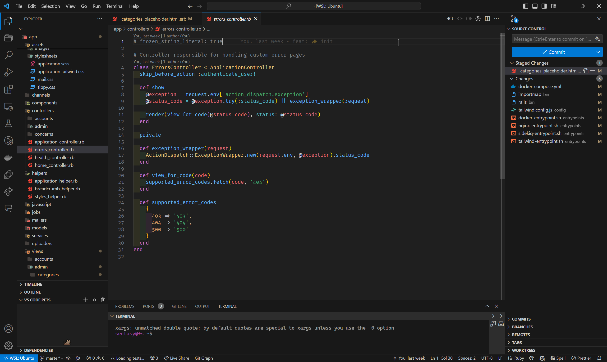
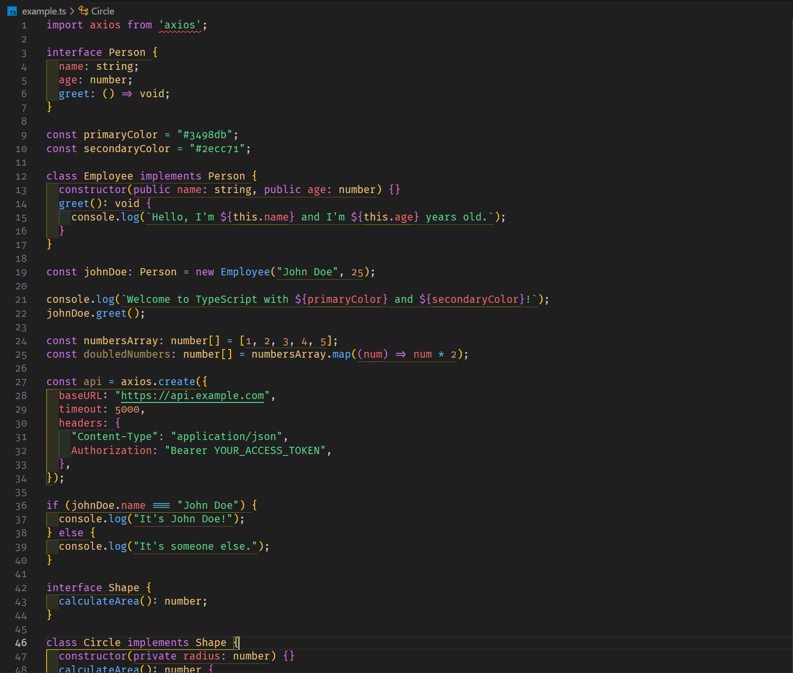

# Better Dark

## Description
Enhance your coding experience with the `Better dark` theme for Visual Studio Code. This meticulously crafted theme is designed to provide a visually pleasing and productive environment for developers.


## Preview





## Installation

1. Download and install theme

	Open the File Explorer (Windows) or Finder (macOS), and navigate to the VSCode extensions folder. The location of this folder depends on your operating system:
	```sh
	# for windows machines
	cd %USERPROFILE%\.vscode\extensions && mkdir theme-better-dark && git clone https://github.com/sectasy0/Better-dark

	# for macOS
	cd ~/.vscode/extensions && mkdir theme-better-dark && git clone https://github.com/sectasy0/Better-dark
	```

1. Press `CTRL + SHIFT + P` and type `Color Theme` then type `Better Dark Pro`
